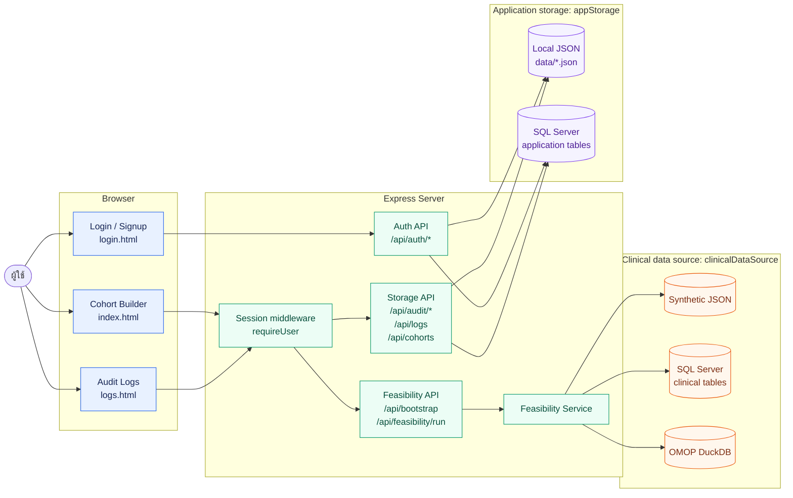
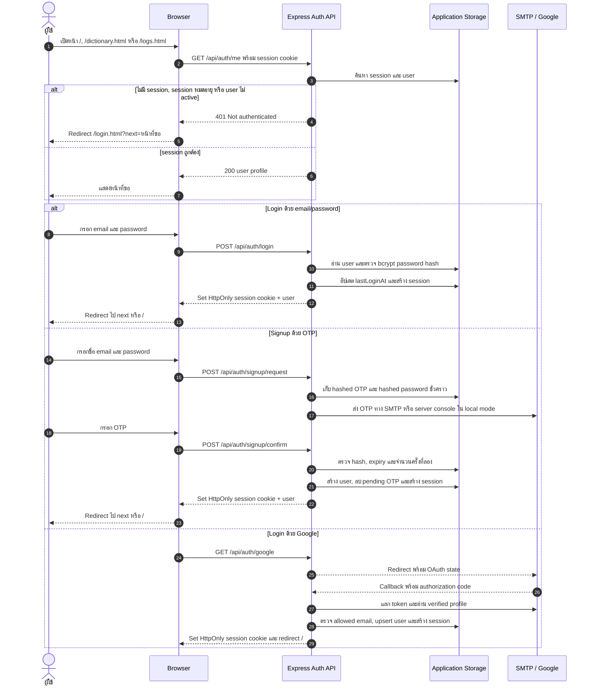
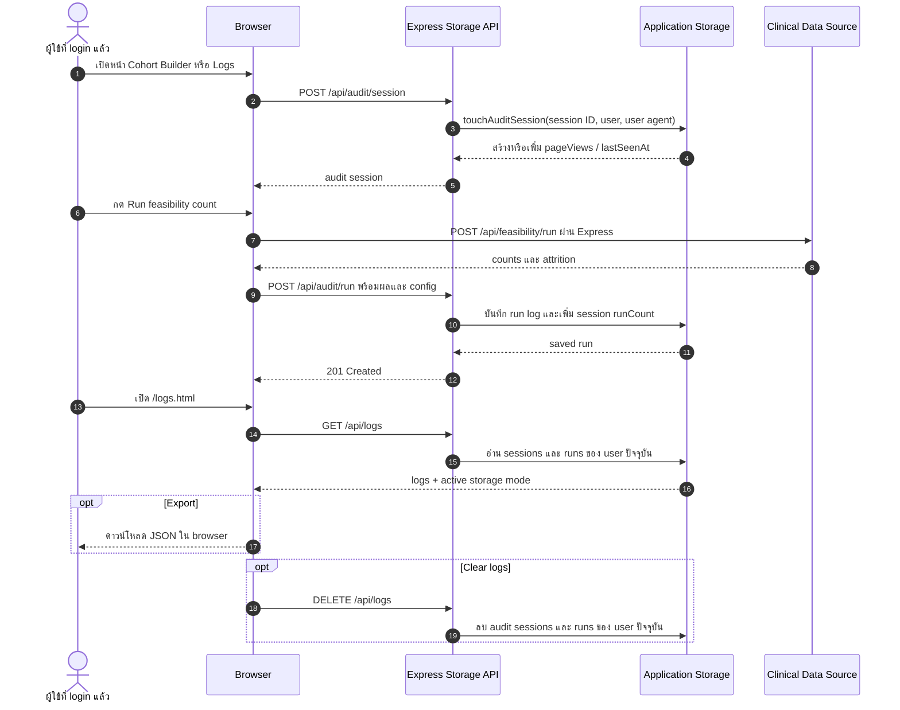

# ภาพรวมการทำงานของระบบ Cohort Lens

เอกสารนี้อธิบายเส้นทางหลักของ web application ตั้งแต่ผู้ใช้เปิดหน้าเว็บ
ผ่านการยืนยันตัวตน กำหนดเกณฑ์และคำนวณ cohort จนถึงการจัดเก็บ session
และ audit log โดยอ้างอิงพฤติกรรมของระบบปัจจุบัน

> **คำสำคัญ:** Clinical data และ application data ใช้ storage คนละส่วนกัน
> และตั้งค่าแยกกันได้ผ่าน `clinicalDataSource` และ `appStorage`

## 1. System overview



| กลุ่ม | หน้าที่ |
| --- | --- |
| Browser | แสดงหน้า login, cohort builder และ audit logs |
| Express Server | ให้บริการ static files, API, ตรวจ session และเลือก repository |
| Clinical data source | ข้อมูลผู้ป่วยและ clinical events ที่ใช้คำนวณ cohort |
| Application storage | ข้อมูล user, session, OTP, saved cohort และ audit log |

ระบบเลือก clinical backend ได้ 3 แบบ (`json`, `sqlserver`, `omop-duckdb`)
และเลือก application storage ได้ 2 แบบ (`local`, `sqlserver`) โดยไม่จำเป็นต้อง
ใช้ backend ชนิดเดียวกัน เช่น clinical data อาจอยู่ใน OMOP DuckDB ขณะที่ session
และ audit log ยังเก็บเป็น local JSON ได้

## 2. การเข้าใช้งานและ authentication



### การตรวจ session

- Browser ส่ง cookie ชื่อ `cohort_lens_session` ไปกับ request แบบ same-origin
- Cookie เป็น `HttpOnly`, `SameSite=Lax` และเปิด `Secure` ตามค่า
  `server.cookieSecure`
- Server นำ session ID ไปอ่านจาก application storage แล้วตรวจว่า session
  ยังไม่หมดอายุ, ไม่ถูก revoke และ user ยัง active
- API สำหรับ bootstrap, feasibility, cohort request, saved cohorts และ logs
  เรียก `requireUser`; ถ้าตรวจไม่ผ่านจะตอบ `401`
- Logout เรียก `POST /api/auth/logout` เพื่อลบ session ฝั่ง server, ทำให้ cookie
  หมดอายุ และกลับไปหน้า login

Forgot-password ใช้ OTP flow ลักษณะเดียวกับ signup แต่หลังยืนยัน OTP แล้วระบบจะ
อัปเดต bcrypt password hash และให้ผู้ใช้กลับไป login ใหม่

## 3. การกรอก criteria และคำนวณ cohort

```mermaid
flowchart TD
  Start([ผู้ใช้เปิด Cohort Builder]) --> Auth[GET /api/auth/me<br/>ตรวจ session]
  Auth --> Bootstrap[GET /api/bootstrap<br/>โหลด concept catalog และ data-source metadata]
  Bootstrap --> Input[กรอก T0 / index event<br/>ช่วงวันที่ / demographics<br/>inclusion / exclusion]
  Input --> Validate{Filter tree<br/>ผ่าน validation?}
  Validate -- ไม่ผ่าน --> Error[แสดง validation error<br/>ไม่ส่ง query]
  Validate -- ผ่าน --> Request[POST /api/feasibility/run<br/>{ config }]
  Request --> RequireUser[requireUser ตรวจ session]
  RequireUser --> Service[FeasibilityService<br/>เลือก repository ตาม clinicalDataSource]

  Service --> Source{Clinical data source}
  Source -- json --> JSON[อ่าน synthetic-clinical-data.json<br/>หรือไฟล์ example]
  JSON --> Engine[evaluateCohort ใน Node.js]

  Source -- sqlserver --> SQLBuild[สร้าง SQL Server CTE query]
  SQLBuild --> SQLDB[(Patient_Info<br/>Diagnosis<br/>Laboratory<br/>Medication)]

  Source -- omop-duckdb --> OMOPBuild[สร้าง OMOP DuckDB query]
  OMOPBuild --> OMOPDB[(person / concept<br/>condition_occurrence<br/>measurement / drug_exposure)]

  Engine --> Result[ผลลัพธ์ count และ attrition]
  SQLDB --> Result
  OMOPDB --> Result
  Result --> Render[แสดง T0 count, final count<br/>attrition diagram และ SQL preview]
  Render --> ManualRun{เกิดจากผู้ใช้กด<br/>Run feasibility count?}
  ManualRun -- ใช่ --> Audit[POST /api/audit/run]
  ManualRun -- ไม่ใช่ เช่น initial run --> NoAudit[ไม่สร้าง run log]

  classDef input fill:#e8f1ff,stroke:#2563eb,color:#172554;
  classDef api fill:#ecfdf5,stroke:#059669,color:#064e3b;
  classDef data fill:#fff7ed,stroke:#ea580c,color:#7c2d12;
  classDef log fill:#f5f3ff,stroke:#7c3aed,color:#4c1d95;
  class Start,Input,Validate,Error,Render,ManualRun input;
  class Auth,Bootstrap,Request,RequireUser,Service,Source,SQLBuild,OMOPBuild,Engine api;
  class JSON,SQLDB,OMOPDB,Result data;
  class Audit,NoAudit log;
```

### สิ่งที่ส่งไปคำนวณ

`config` ประกอบด้วย research question, T0/index events, index date window,
demographics, inclusion criteria และ exclusion criteria โดยแต่ละส่วนรองรับ
filter tree แบบ nested `AND`/`OR` และ operator ตามชนิดข้อมูล

### วิธี query ในแต่ละโหมด

| `clinicalDataSource` | การคำนวณ | แหล่งข้อมูลหลัก |
| --- | --- | --- |
| `json` | โหลดข้อมูล synthetic แล้วประมวลผลด้วย cohort engine ใน Node.js | `public/data/synthetic-clinical-data.json` หรือไฟล์ `_example.json` |
| `sqlserver` | สร้าง SQL แบบ CTE และส่ง query ผ่าน `mssql` | `Patient_Info`, `Diagnosis`, `Laboratory`, `Medication` |
| `omop-duckdb` | สร้าง OMOP SQL และส่ง query ผ่าน DuckDB adapter | `person`, `condition_occurrence`, `measurement`, `drug_exposure`, `concept` |

ผลลัพธ์ส่งกลับเป็นจำนวนผู้ป่วยที่เข้า T0, จำนวนหลัง demographic/inclusion/exclusion,
จำนวนสุดท้าย และ attrition ในแต่ละขั้น Generated SQL ที่แสดงใน browser เป็น
SQL preview สำหรับตรวจสอบ ส่วน query ที่ถูกใช้จริงจะสร้างโดย repository ของ
data source ที่ active

## 4. การเก็บ session และ audit log



### เก็บข้อมูลอะไรบ้าง

| ชนิดข้อมูล | ข้อมูลที่จัดเก็บ |
| --- | --- |
| Authentication session | session ID, user ID, expiry, user agent และ IP address; SQL mode มี started/last seen และ revoked timestamp ด้วย |
| Audit session | session ID, user, started time, last seen time, page views, run count และ user agent |
| Feasibility run | run ID, session/user, created time, research question, T0 count, final count, excluded count, attrition, selected concepts, cohort config, generated SQL และ clinical data source |
| Saved cohort | user ID, ชื่อ, saved/updated time, research question และ cohort config |
| Pending OTP | purpose, email/user, hashed OTP, attempts, expiry และ payload ที่จำเป็นต่อ flow |

Password และ OTP ไม่ถูกเก็บเป็น plain text: credential password ใช้ bcrypt hash
และ pending OTP เก็บเฉพาะ hash อย่างไรก็ตาม run log เก็บ cohort config และ SQL
ฉบับเต็ม จึงควรหลีกเลี่ยงการใส่ข้อมูลระบุตัวผู้ป่วยใน research question หรือ criteria

### เก็บไว้ที่ไหน

| ข้อมูล | `appStorage: local` | `appStorage: sqlserver` |
| --- | --- | --- |
| Users | `data/users.json` | `dbo.App_Users` |
| Authentication sessions | `data/user-sessions.json` | `dbo.User_Sessions` |
| Pending OTPs | `data/pending-otps.json` | `dbo.Pending_Otp` |
| Saved cohorts | `data/saved-cohorts.json` | `dbo.Saved_Cohorts` |
| Audit sessions | `data/audit-session-logs.json` | `dbo.Audit_Session_Log` |
| Feasibility runs | `data/feasibility-run-logs.json` | `dbo.Feasibility_Run_Logs` |

Local storage จำกัดข้อมูลล่าสุดไว้ที่ audit sessions 200 รายการ, feasibility runs
500 รายการ และ saved cohorts 200 รายการ ส่วน SQL Server implementation ปัจจุบัน
ไม่มี application-level retention limit

หน้า `/logs.html` แสดงและลบเฉพาะข้อมูลที่ตรงกับ user ID ของผู้ใช้ปัจจุบัน
การ export เกิดใน browser โดยรวม session และ run logs ที่ API ส่งกลับมาเป็นไฟล์ JSON

> **หมายเหตุ:** SQL initialization script สร้างตาราง `dbo.Auth_Event_Log` ไว้แล้ว
> แต่ application ปัจจุบันยังไม่มี code path ที่เขียน authentication event ลงตารางนี้

## 5. Endpoint summary

| Endpoint | Authentication | หน้าที่ |
| --- | --- | --- |
| `GET /api/auth/me` | ต้องมี session | อ่าน user ของ session ปัจจุบัน |
| `POST /api/auth/login` | ไม่ต้องมี session | ตรวจ credentials และสร้าง session |
| `POST /api/auth/signup/request` | ไม่ต้องมี session | สร้างและส่ง signup OTP |
| `POST /api/auth/signup/confirm` | ไม่ต้องมี session | ยืนยัน OTP, สร้าง user และ session |
| `GET /api/auth/google` | ไม่ต้องมี session | เริ่ม Google OAuth flow |
| `POST /api/auth/logout` | ไม่บังคับ | ลบ session และทำให้ cookie หมดอายุ |
| `GET /api/bootstrap` | ต้องมี session | โหลด concept catalog และ storage metadata |
| `POST /api/feasibility/run` | ต้องมี session | คำนวณ cohort จาก criteria |
| `POST /api/audit/session` | ต้องมี session | สร้างหรืออัปเดต audit session |
| `POST /api/audit/run` | ต้องมี session | บันทึกผล feasibility run |
| `GET /api/logs` | ต้องมี session | อ่าน log ของ user ปัจจุบัน |
| `DELETE /api/logs` | ต้องมี session | ลบ log ของ user ปัจจุบัน |
| `GET/POST /api/cohorts` | ต้องมี session | อ่านหรือบันทึก saved cohort |

