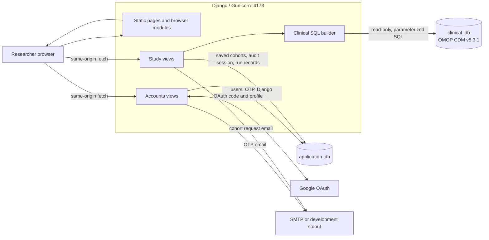
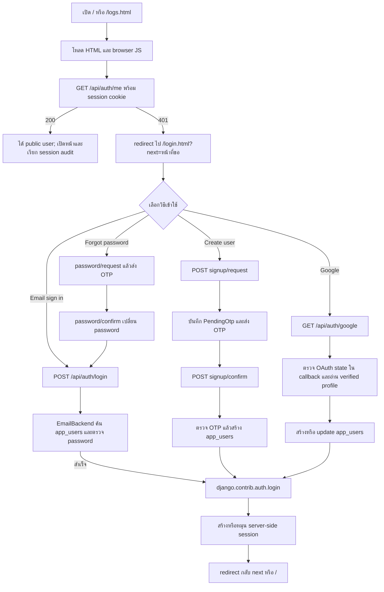
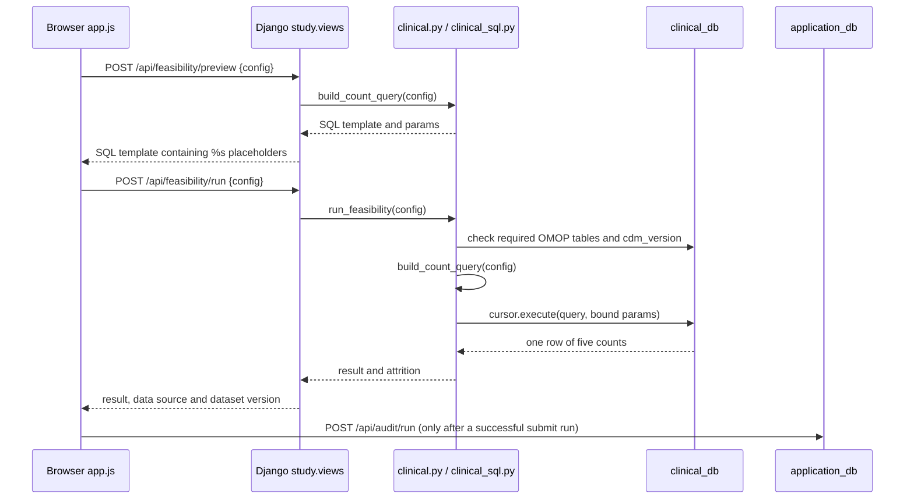
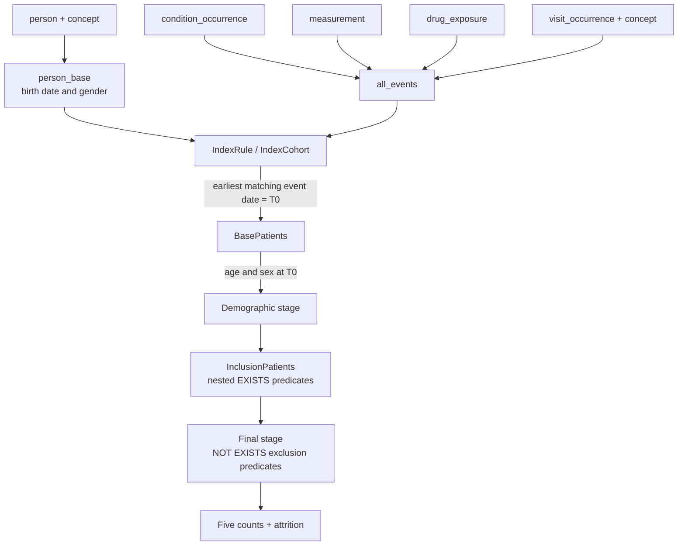
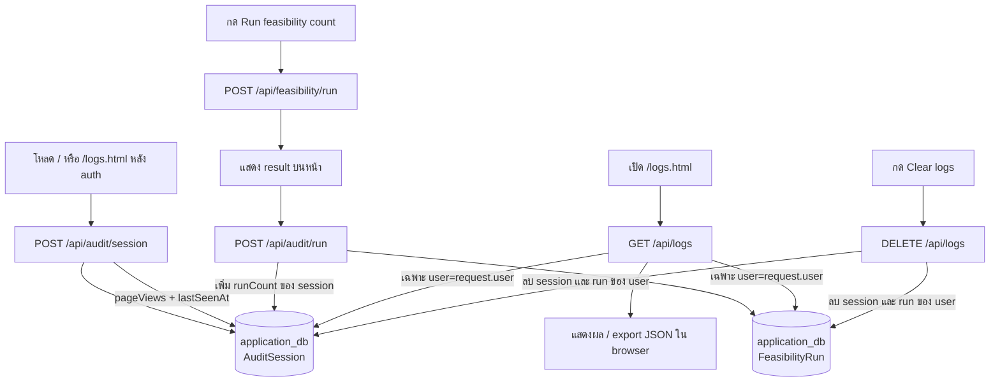

# Project Overview: Cohort Lens

เอกสารนี้อธิบายพฤติกรรมปัจจุบันของ Cohort Lens จากโค้ดใน repository: webapp
สำหรับสร้าง cohort และนับจำนวนผู้ป่วยตาม OMOP CDM โดยใช้ Django เป็น backend,
plain JavaScript เป็น frontend และ PostgreSQL แยกเป็นฐานข้อมูล application กับ
clinical

## 1. ภาพรวมระบบ



องค์ประกอบสำคัญมีดังนี้

- Browser ได้ HTML และ JavaScript จาก Django แล้วเรียก API แบบ same-origin;
  browser ไม่ได้ต่อ `clinical_db` โดยตรง และไม่มี clinical data file ที่โหลดใน
  browser
- `application_db` เก็บข้อมูลที่ Django จัดการ ได้แก่ user, Django session,
  pending OTP, saved cohort และ audit records
- `clinical_db` เก็บ OMOP CDM v5.3.1 โดย web role ใช้สิทธิ์อ่านอย่างเดียว
- สองฐานข้อมูลไม่มี cross-database foreign key หรือ transaction ร่วมกัน ดังนั้น
  การรัน query ทางคลินิกและการบันทึก audit เป็นคนละ API request/operation
- `/api/health` ตรวจทั้ง application database และความพร้อมของ `clinical_db`
  (ตารางที่จำเป็นและ CDM version) แต่ไม่ต้อง login

### เส้นทางหลัก

| URL | หน้าที่ | ต้อง login หรือไม่ |
| --- | --- | --- |
| `/` หรือ `/index.html` | Cohort builder, result, SQL preview, saved cohorts และ request cohort | ต้องมี session; JS จะ redirect ถ้าไม่มี |
| `/login.html` | Sign in, create user, forgot password และ Google sign-in | ไม่ต้อง |
| `/logs.html` | แสดง audit session และ feasibility run ของ user ปัจจุบัน | ต้องมี session; JS จะ redirect ถ้าไม่มี |
| `/api/health` | ตรวจ database และ OMOP readiness | ไม่ต้อง |
| `/api/feasibility/preview` | สร้าง SQL preview โดยยังไม่ execute | ต้องมี session |
| `/api/feasibility/run` | execute feasibility count บน `clinical_db` | ต้องมี session |
| `/api/audit/session`, `/api/audit/run`, `/api/logs` | สร้างและอ่าน audit records | ต้องมี session |
| `/api/cohorts` | โหลดหรือบันทึก saved cohort ของ user | ต้องมี session |

## 2. User เข้าเว็บแล้วไปที่ไหน และ authentication ทำงานอย่างไร



รายละเอียดของ flow:

1. `page()` ใน `src/config/urls.py` ส่งหน้า static ให้ก่อน โดยตัว page view เอง
   ไม่ได้กันหน้า HTML ด้วย server-side redirect การกันสิทธิ์เกิดเมื่อ
   `authClient.js` เรียก `/api/auth/me` หลังโหลด JavaScript
2. ถ้า `/api/auth/me` ได้ 401, `requireAuth()` ใช้ `location.replace()` ไป
   `/login.html` และเก็บ path เดิมไว้ใน `next` เมื่อ login สำเร็จจะกลับไปหน้านั้น
3. หลัง login สำเร็จ Django ใช้ `login(request, user)` เก็บ user id ใน
   database-backed session และ browser ได้ cookie ชื่อ `cohort_lens_session`
   (อายุ 8 ชั่วโมง, `HttpOnly`, `SameSite=Lax`; `Secure` ขึ้นกับ `COOKIE_SECURE`)
4. ใน request ถัดไป `SessionMiddleware` อ่าน session และ
   `AuthenticationMiddleware` เติม `request.user` โดยใช้ `EmailBackend.get_user()`
   ซึ่งรับเฉพาะ user ที่ `is_active=True`
5. API ที่เป็นข้อมูลหรือการคำนวณเรียก `require_user()` อีกชั้นหนึ่ง ถ้า
   `request.user.is_authenticated` เป็น false จะตอบ JSON 401 `Not authenticated`
   ดังนั้นการมีข้อมูลใน `sessionStorage` ของ browser ไม่เพียงพอที่จะผ่าน auth
6. `sessionStorage` key `cohort-lens.auditUser.v1` เป็นเพียงข้อมูล user สำหรับ
   client UI และถูกลบตอน logout ไม่ใช่แหล่งยืนยันตัวตน
7. POST ใช้ CSRF protection ของ Django: หน้าและ `/api/auth/me` ช่วยตั้ง
   `csrftoken` cookie และ browser module ส่งค่าใน `X-CSRFToken`

### Sign up และ password reset

- `signup/request` ตรวจชื่อ, email และ password อย่างน้อย 8 ตัวอักษร จากนั้นเก็บ
  bcrypt hash ไว้ใน `PendingOtp.payload` พร้อม OTP hash, expiry 10 นาที และ
  attempt counter สูงสุด 5 ครั้ง ไม่เก็บ OTP แบบ plain text ใน database
- `signup/confirm` ตรวจ OTP แล้วสร้าง `app_users`, ลบ `PendingOtp` และ login ให้
  ทันที
- ถ้าไม่มี `SMTP_HOST` ในโหมด development OTP จะพิมพ์ไป process stdout เพื่อ
  ทดสอบในเครื่อง; นอก development หากไม่มี SMTP จะไม่อนุญาตให้ส่ง OTP
- `password/request` ตอบแบบเดียวกันแม้ไม่พบ email เพื่อลดการเปิดเผยว่า email มี
  account หรือไม่ ส่วน `password/confirm` จะเปลี่ยน password และให้กลับไป sign in
- Google flow ใช้ state cookie อายุ 10 นาที, แลก authorization code กับ Google,
  ตรวจ `email_verified` และถ้ามีการกำหนด `GOOGLE_ALLOWED_EMAILS` ก็ต้องอยู่ใน
  allow-list ก่อนสร้างหรือ update user

## 3. จากการกรอก criteria ไปสู่ query ฐานข้อมูล

### 3.1 ข้อมูลที่ส่งจาก browser

หน้า `/` เก็บ form เป็น cohort configuration tree โดยมีส่วนหลักดังนี้

```json
{
  "indexEvents": [],
  "indexWindow": { "from": "", "to": "" },
  "demographics": { "minAge": "", "maxAge": "", "sex": "Any" },
  "inclusionCriteria": [],
  "exclusionCriteria": []
}
```

แต่ละ rule มี nested condition groups ซึ่งใช้ `AND` หรือ `OR` ได้ ฟิลด์ที่ใช้ได้
ครอบคลุม domain, code, name, group, event date, numeric/raw value,
patient category, age at event และ `daysFromT0` (ใช้ได้กับ inclusion/exclusion;
ไม่ใช้กับ T0)

### 3.2 Preview กับการคำนวณจริง



เมื่อกด `Run feasibility count` ลำดับคือ

1. `app.js` อ่านค่าจาก form และ validate condition tree ใน browser
2. ส่ง `POST /api/feasibility/run` พร้อม `{ "config": ... }` และ CSRF header
3. `feasibility_run()` ตรวจ authentication แล้วเรียก `run_feasibility()`
4. ก่อน query ระบบตรวจว่า `clinical_db` มี `person`, `concept`,
   `condition_occurrence`, `measurement`, `drug_exposure`, `visit_occurrence` และ
   `cdm_source` และ `cdm_source.cdm_version` ต้องเป็น `v5.3.1`; ถ้าไม่ผ่านตอบ 503
5. `build_count_query()` สร้าง PostgreSQL CTE และส่งค่าผ่าน parameter binding
   (`%s`) ค่าจาก user จึงไม่ถูกต่อ string เข้า SQL โดยตรง
6. Django ใช้ connection alias `clinical` และ role ที่อ่านอย่างเดียว execute query
   บน `clinical_db`; ไม่ได้ใช้ `application_db` สำหรับ clinical count
7. query คืนหนึ่งแถวที่มี `totalPatients`, `indexEligibleCount`,
   `demographicCount`, `inclusionCount` และ `finalCount` จากนั้น backend สร้าง
   `excludedCount` และ `attrition` สำหรับแสดงผล

### 3.3 Query ทำงานเป็นขั้นอย่างไร



- `person_base` รวม person กับ concept ของเพศ และคำนวณ birth date โดยมี fallback
  จาก year/month/day เมื่อไม่มี `birth_datetime`
- `all_events` ทำ event stream กลางจาก `condition_occurrence` (diagnosis),
  `measurement` (lab) และ `drug_exposure` (drug) พร้อม concept/source values,
  date, numeric value, visit category และ age at event
- `IndexRule` เลือก event ที่ตรง T0 rules และ `IndexCohort` เลือกวันที่ matching
  เร็วที่สุดต่อ person เป็น `t0_date`; joiner ระหว่าง rules และ nested group logic
  คงไว้ใน SQL
- `BasePatients` ใช้ T0 เป็นจุดคำนวณอายุ แล้วกรอง min/max age และ sex
- `InclusionPatients` ตรวจแต่ละ inclusion rule ด้วย `EXISTS` บน event ของ person
  เดียวกัน ฟิลด์ `daysFromT0` คำนวณจาก `event_date - t0_date`
- final stage ใช้ `NOT EXISTS` กับ exclusion rules; ผลคือคนที่ผ่าน T0,
  demographics และ inclusion แต่ไม่เข้า exclusion
- ถ้าไม่มี active index rule query จะคืน `totalPatients` และค่า downstream เป็นศูนย์
  ตาม contract ปัจจุบัน ไม่ใช่การคืนรายชื่อผู้ป่วย
- response ปัจจุบันตั้ง `included`, `rows` และ `conceptSummary` เป็นโครงว่าง จึง
  ส่งกลับเฉพาะ aggregate counts/attrition ไม่ส่ง patient-level rows

SQL preview ที่แสดงบนหน้าเป็น SQL template สำหรับตรวจสอบ logic และมี `%s` อยู่
เพราะ endpoint preview ไม่ได้ execute และไม่ได้คืนค่าพารามิเตอร์ที่ bind จริง ส่วน
live query bind ค่าเหล่านั้นแยกต่างหาก

## 4. เก็บ log อย่างไร เก็บอะไร และเก็บไว้ที่ไหน

คำว่า log ในระบบนี้มีสองชนิดที่ผู้ใช้เห็นบน `/logs.html`: `AuditSession` และ
`FeasibilityRun` ทั้งคู่เก็บใน `application_db` และ filter ด้วย user ปัจจุบัน



### รายการข้อมูลที่จัดเก็บ

| Record | ที่เก็บ | เก็บเมื่อใด | ข้อมูลหลัก |
| --- | --- | --- | --- |
| User | `application_db.app_users` | login/signup/Google สร้างหรือ update | `id`, email, name, role, provider, Google subject, active flag, password hash และ timestamps |
| Django session | `application_db.django_session` | Django สร้าง session หลัง login หรือเมื่อ audit ต้องมี session key | session data และ expiry; browser ถือแค่ cookie `cohort_lens_session` |
| Pending OTP | `application_db.study_pendingotp` | ขอสร้าง user หรือ reset password | purpose, email, user link, OTP hash, attempts, expiry และ payload ชั่วคราว |
| Audit session | `application_db.study_auditsession` | เปิด builder/logs หลัง auth | session id, user, started/last seen, `page_views`, `run_count`, user agent |
| Feasibility run | `application_db.study_feasibilityrun` | หลัง submit run สำเร็จและ audit POST สำเร็จ | user/session, timestamp, question, T0/final/excluded counts, attrition, selected concepts, full config, SQL preview, data source และ dataset version |
| Saved cohort | `application_db.study_savedcohort` | กด Save current | user, name, config และ saved timestamp; เป็น definition ไม่ใช่ run log |

### จุดที่ควรรู้เกี่ยวกับ lifecycle ของ log

- `/api/audit/session` ถูกเรียกหนึ่งครั้งตอนเริ่มหน้า builder และหน้า logs ระบบจะ
  `get_or_create` ด้วย Django session key แล้วเพิ่ม `page_views` และอัปเดต
  `last_seen_at`
- automatic run ตอนเปิดหน้า, run หลัง load saved cohort และ run หลัง save cohort
  เรียก `run()` โดยไม่มี `logRun: true` จึงไม่สร้าง `FeasibilityRun`; การกดปุ่ม
  `Run feasibility count` เท่านั้นที่เรียก `recordFeasibilityRun()`
- client ส่ง config, result counts, attrition, selected concepts และ SQL preview;
  server เติม user จาก session, session id, timestamp, `data_source=omop-postgres`
  และ dataset version จาก settings หาก request ไม่ส่งมา
- GET `/api/logs` query เฉพาะ `AuditSession.objects.filter(user=request.user)` และ
  `FeasibilityRun.objects.filter(user=request.user)` ไม่มี endpoint ในปัจจุบันที่ให้
  user เห็น log ของคนอื่น
- Search และ Export JSON ทำใน browser หลังโหลด records แล้ว; export ไม่ได้บันทึก
  ไฟล์กลับเข้า server
- Clear logs เป็น `DELETE` จริงสำหรับ run และ session ของ user ปัจจุบัน และไม่มี
  retention job หรือ soft-delete flow สำหรับ audit records ในโค้ดที่มีอยู่
- saved cohort มี field `deleted_at` แต่ endpoint delete ปัจจุบันใช้ `.delete()`
  จึงเป็น hard delete และไม่ใช่ audit log

### สิ่งที่ยังไม่ใช่ log ที่ทำงานอยู่

`AuthEvent` model และ migration มี field `user`, `email`, `event_type`,
`event_status` และ `created_at` แต่ไม่มี view/service ใดสร้าง `AuthEvent` record
ในปัจจุบัน ดังนั้น login, logout, signup, password reset และ Google OAuth ยังไม่
ปรากฏใน `/api/logs` และไม่ได้ถูกเก็บเป็น authentication audit event

สำหรับ operational logging โค้ดไม่มี `LOGGING` configuration หรือ custom request
logging ใน Django ข้อมูลที่เห็นนอกฐานข้อมูลขึ้นกับ stdout/stderr ของ web process
(ตัวอย่างเช่น development OTP เมื่อไม่มี SMTP) ไม่ควรใส่ PHI หรือ clinical row
ลงใน log; เอกสาร deployment กำหนดให้ clinical data อยู่นอก logs และใช้ข้อมูล
de-identified ใน development

## 5. ไฟล์ต้นทางที่ใช้ตรวจสอบ

- [URL routes](../../src/config/urls.py)
- [Authentication views](../../src/apps/accounts/views.py) และ
  [authentication backend](../../src/apps/accounts/auth.py)
- [Study views](../../src/apps/study/views.py) และ
  [study models](../../src/apps/study/models.py)
- [Clinical execution](../../src/apps/study/clinical.py) และ
  [PostgreSQL SQL builder](../../src/apps/study/clinical_sql.py)
- [Browser authentication client](../../public/assets/js/authClient.js),
  [builder app](../../public/assets/js/app.js) และ [audit store](../../public/assets/js/auditStore.js)
