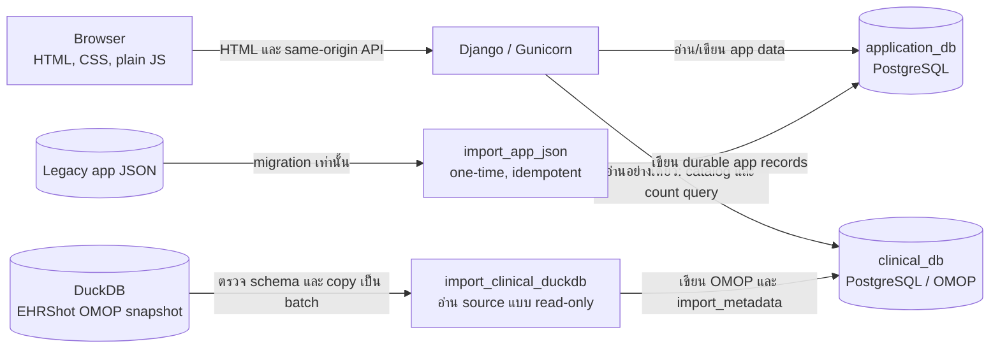
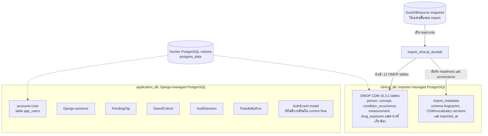
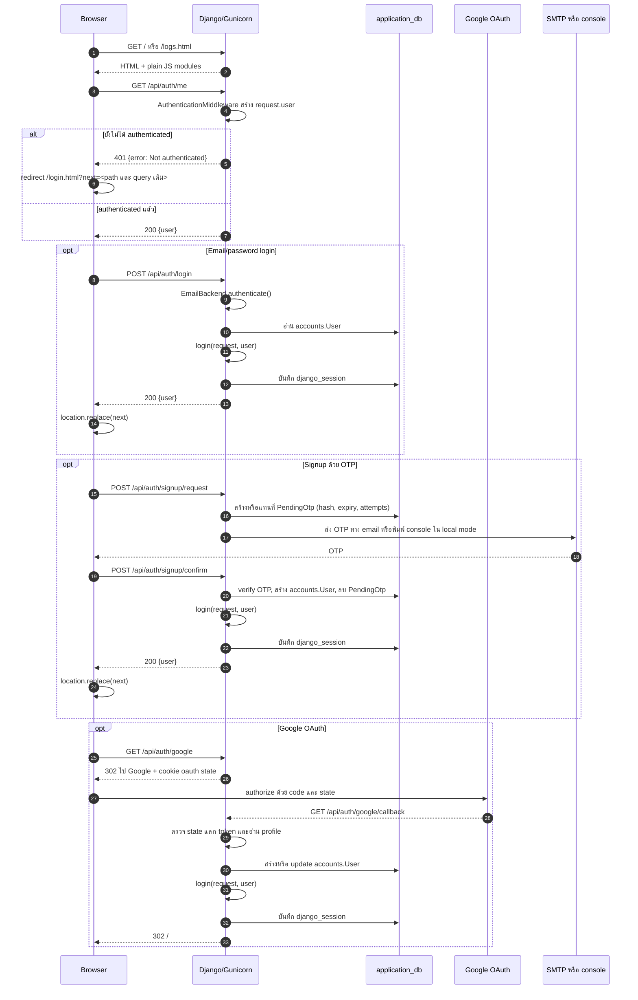
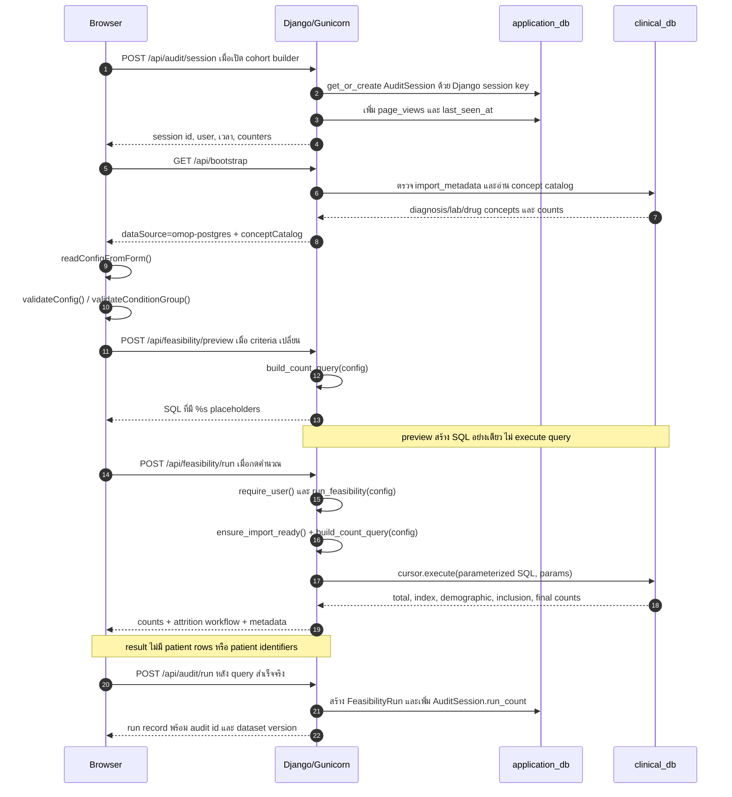

# Project Overview: Cohort Lens

เอกสารนี้อธิบาย implementation ปัจจุบันของ Cohort Lens สำหรับประเมินความเป็นไปได้ของ cohort ในข้อมูลวิจัยแบบ OMOP CDM โดยยึดตาม source code ใน repository นี้ ไม่ใช่สถาปัตยกรรมที่วางแผนไว้ในอนาคต

## ภาพรวมสถาปัตยกรรม

Browser ได้รับ HTML, CSS และ plain JavaScript modules จาก Django ส่วน Django/Gunicorn เป็นจุดกลางสำหรับ authentication, API validation, saved cohorts, audit logs และการเรียก query ทางคลินิก

`application_db` และ `clinical_db` เป็น PostgreSQL database แยกกันบน PostgreSQL instance เดียวกัน ไม่มี cross-database foreign key หรือ transaction ร่วมกัน เว็บใช้ role `clinical_reader` กับ `clinical_db` แบบ read-only ส่วนคำสั่ง import ใช้ role `clinical_importer` สำหรับการเขียน clinical schema และ metadata

## การจัดเก็บข้อมูลและขอบเขตการเข้าถึง

| พื้นที่ | ข้อมูลหลัก | การใช้งานปัจจุบัน |
| --- | --- | --- |
| `application_db` | `accounts.User`, Django sessions, `PendingOtp`, `SavedCohort`, `AuditSession`, `FeasibilityRun` และตารางของ `AuthEvent` | Django อ่าน/เขียนผ่าน default connection |
| `clinical_db` | OMOP tables และ `import_metadata` | เว็บอ่านผ่าน `clinical_reader`; importer เขียนผ่าน `clinical_importer` |
| PostgreSQL volume | ไฟล์ persistent storage ของทั้งสอง database | ทำให้ข้อมูลอยู่ต่อเมื่อ container หยุด/เริ่มใหม่ |
| DuckDB/source snapshot | EHRShot OMOP v5.3.1 ต้นทาง | ใช้โดย `import_clinical_duckdb` ตอน import เท่านั้น ไม่ใช่ runtime query store |

Clinical import จะพร้อมใช้งานเมื่อมี `import_metadata` ของ `source_name = ehrshot_omop` เท่านั้น ตัว importer ตรวจว่ามี 12 ตาราง, ใช้ CDM v5.3.1, ตรวจ schema fingerprint, ตรวจ row count ระหว่าง copy และบันทึก vocabulary versions/เวลา import ก่อนให้ระบบใช้ข้อมูลได้ ส่วนข้อมูล application JSON เป็นเส้นทาง migration แบบ idempotent; session เก่าหรือ pending OTP จากไฟล์เดิมไม่ถูกนำมาใช้เป็น authentication session

## User flow และ authentication

หน้า `/` และ `/logs.html` สามารถส่ง HTML ได้ แต่ JavaScript จะเรียก `requireAuth()` ก่อนใช้ข้อมูลหรือ API ที่ป้องกันไว้ โดยเรียก `/api/auth/me` พร้อม session cookie

`SessionMiddleware` และ `AuthenticationMiddleware` ใช้ Django database session engine กับ cookie ชื่อ `cohort_lens_session` (อายุ 8 ชั่วโมง, `HttpOnly`, `SameSite=Lax`) เพื่อให้ request ถัดไปมี `request.user` โดยตรง API สำคัญใน `apps.study.views` ตรวจซ้ำด้วย `request.user.is_authenticated` ผ่าน `require_user()` และคืน `401` หากไม่มีผู้ใช้

`next` ถูกอ่านจาก query string โดย `login.js` และใช้กับ email login และ signup/OTP สำเร็จ ปัจจุบัน `google_callback()` ใน backend ยัง redirect ไป `/` โดยตรง จึงไม่รักษา `next` สำหรับเส้นทาง Google OAuth การ logout เรียก `POST /api/auth/logout`, ล้าง Django session และลบข้อมูล user ที่เก็บไว้ใน `sessionStorage`

กรณีลืมรหัสผ่านใช้ `POST /api/auth/password/request` เพื่อส่ง OTP และ `POST /api/auth/password/confirm` เพื่อเปลี่ยน password หลังยืนยัน OTP; flow นี้ยังไม่ login user ให้โดยอัตโนมัติ

`sessionStorage` key `cohort-lens.auditUser.v1` เก็บเพียง `id`, email, name, provider และ role เพื่อแสดงผลใน UI หรือช่วย audit client ไม่ใช่แหล่ง authentication หลัก การยืนยันตัวตนยังมาจาก `/api/auth/me` และ Django session cookie เสมอ

การเปลี่ยนแปลงข้อมูลใช้ same-origin credentials และ CSRF header จาก `csrf.js`; หน้าและ `/api/auth/me` ช่วยตั้ง CSRF cookie ให้ browser

## Feasibility query flow

ผู้ใช้กำหนดองค์ประกอบของ cohort ดังนี้:

1. T0/index event และช่วงวัน `indexWindow`
2. demographics ได้แก่ `minAge`, `maxAge` และ `sex`
3. inclusion criteria
4. exclusion criteria

แต่ละ criteria เป็น nested condition group ที่เลือก field, operator, value และ logic `AND`/`OR` ได้ โดย inclusion/exclusion ใช้ field `daysFromT0` เพื่ออ้างอิง event เทียบกับ index date

### การสร้าง query และการคำนวณ count

`build_count_query()` รับ config ที่ backend ตรวจชนิดและ operator อีกครั้ง ค่าจากผู้ใช้ถูกส่งเป็น bound parameters ของ PostgreSQL; identifier และโครงสร้าง SQL มาจากชุดค่าคงที่ใน `clinical_sql.py` จึงไม่เอาค่า filter ไปต่อ string เป็น SQL โดยตรง

Query ใช้ CTE หลักตามลำดับต่อไปนี้:

- `person_base` รวม `person_id`, วันเกิดที่คำนวณได้ และ gender จาก OMOP concept/source value
- `all_events` รวม event จาก `condition_occurrence`, `measurement` และ `drug_exposure` พร้อม concept, visit category, event date และค่าที่ใช้กรอง
- `IndexRule*` สร้างผู้ที่ตรงกับแต่ละ T0 rule และ `IndexCohort` รวมเป็น cohort entry โดยใช้ `MIN(event_date)` เป็น `t0_date`
- `BasePatients` ใช้ index cohort และ demographic filters
- `InclusionPatients` กรอง inclusion criteria
- final count กรอง exclusion criteria ต่อจาก `InclusionPatients`

Inclusion และ exclusion ใช้ `EXISTS (SELECT 1 FROM all_events ...)` ต่อ person เพื่อทดสอบว่ามี event ที่ตรงกับ filter หรือไม่ จากนั้น query คืน scalar counts 5 ค่า ได้แก่ `totalPatients`, `indexEligibleCount`, `demographicCount`, `inclusionCount` และ `finalCount` พร้อมให้ `run_feasibility()` คำนวณ `excludedCount` และ attrition ระหว่างขั้น

Runtime result ตั้งใจคืนเพียงจำนวนและ workflow: `included`, `rows` และ `conceptSummary` ใน backend result เป็น collection ว่าง จึงไม่ส่ง patient row หรือ identifier กลับ browser การใช้งานใน repository เป็น synthetic/de-identified research data เท่านั้น

## SQL preview flow

เมื่อผู้ใช้แก้ input หรือ condition builder, `app.js` จะ validate config ก่อนเรียก `/api/feasibility/preview` ในโหมด `omop-postgres`; `normalizeCohortConfig()` ใช้ในเส้นทางตั้งค่าและโหลด saved cohort ส่วน condition builder จะ normalize tree ของเงื่อนไขให้เป็นรูปแบบที่ backend รับได้ เพื่อให้ backend สร้าง SQL เดียวกับที่จะใช้จริง หน้าเว็บแสดง SQL ที่ได้พร้อม `%s` placeholders และ summary ของ criteria

Preview เรียก `build_count_query()` และทิ้ง `params` ไม่เรียก `run_feasibility()` หรือ `cursor.execute()` ดังนั้นการดู SQL ไม่ได้อ่านหรือนับข้อมูลใน `clinical_db` และไม่ทำให้เกิด feasibility run audit record

## Audit และ logs

เมื่อเปิด cohort builder หรือ logs page, frontend เรียก `POST /api/audit/session` หลังผ่าน authentication ระบบใช้ Django session key เป็น `AuditSession.id`; ถ้ายังไม่มี key จะสร้าง session ก่อน แล้ว `get_or_create`/เพิ่มข้อมูลต่อไปนี้:

- session id และ user ที่ authenticated
- `started_at` และ `last_seen_at`
- `page_views`
- `user_agent`
- `run_count`

เฉพาะการกดคำนวณจริงที่ `/api/feasibility/run` สำเร็จเท่านั้นจึงเรียก `POST /api/audit/run` โดยบันทึกใน `application_db` เป็น `FeasibilityRun` ได้แก่ question, counts, attrition, selected concepts, config, generated SQL, `dataSource = omop-postgres` และ `datasetVersion` จาก settings/ผลลัพธ์ แล้วเพิ่ม `AuditSession.run_count`

`GET /api/logs` คืน sessions และ runs ที่ filter ด้วย `user=request.user` เท่านั้น หน้า logs ใช้ข้อมูลนี้สำหรับค้นหา แสดงผล และ export JSON ส่วน `DELETE /api/logs` ลบ `FeasibilityRun` และ `AuditSession` ของ user ปัจจุบันเท่านั้น ไม่ลบ user, saved cohorts หรือ clinical data

`AuthEvent` มีอยู่ใน model และ migration แต่ไม่มี code path ปัจจุบันที่สร้างหรือบันทึก auth event ลงตารางนี้ authentication audit ที่มีจริงใน flow นี้จึงเป็น Django session, `AuditSession` และ `FeasibilityRun`

## Fallback และ error contract สำคัญ

| สถานการณ์ | พฤติกรรมปัจจุบัน |
| --- | --- |
| ไม่ authenticated | `/api/auth/me` และ protected API คืน `401`; frontend redirect ไป `/login.html` พร้อม `next` ส่วน Google OAuth callback ปัจจุบัน redirect ไป `/` |
| Clinical import ยังไม่พร้อม | `ensure_import_ready()` หา `import_metadata` ไม่พบ; `/api/bootstrap` และ `/api/health` ใช้ `503`, ส่วน run รายงาน clinical query ใช้งานไม่ได้ด้วย `503` |
| JSON หรือ cohort/filter validation ไม่ผ่าน | `body_json()` หรือ `build_count_query()` เกิด `ValueError`; endpoint ที่เกี่ยวข้องคืน `400` พร้อม `error` |
| SQL/query execution ล้มเหลว | `/api/feasibility/run` จับ exception และคืน `503` เป็น `Unable to run feasibility query` |
| Google OAuth ตั้งค่าไม่ครบ | `/api/auth/google` คืน `503`; state ไม่ถูกต้องคืน `400`, แลก token ไม่สำเร็จคืน `502`, email ไม่ verified/ไม่อยู่ใน allowlist/inactive คืน `403` |

## แหล่งอ้างอิง implementation

- [URL routes](../../src/config/urls.py)
- [Authentication views](../../src/apps/accounts/views.py) และ [authentication backend](../../src/apps/accounts/auth.py)
- [Study API views](../../src/apps/study/views.py)
- [Clinical query builder](../../src/apps/study/clinical_sql.py) และ [clinical execution/readiness](../../src/apps/study/clinical.py)
- [Application models](../../src/apps/accounts/models.py) และ [study/audit models](../../src/apps/study/models.py)
- [Browser authentication client](../../public/assets/js/authClient.js), [login flow](../../public/assets/js/login.js) และ [audit client](../../public/assets/js/auditStore.js)
- [Migration guide](../migration-to-django.md) และ [OMOP adapter notes](omop-cdm-adapter.md)
